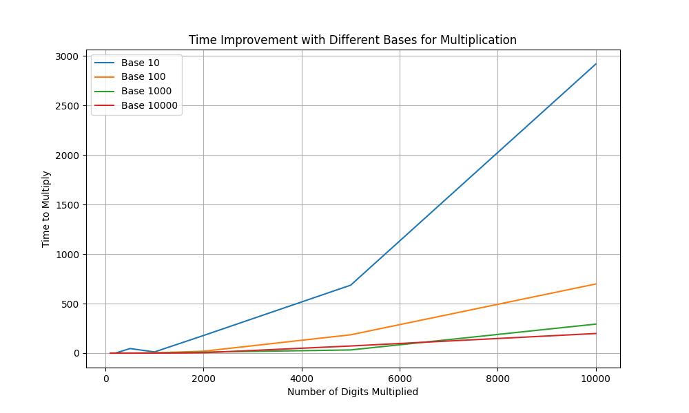

### Compare time taken for large number multiplication in different bases
One evening I thought of an experiment that for multiplying large numbers in c++ instead of doing it digit by digit which is in base 10 I use bigger base (100,1000, 10000) inorder to utilize full power of integer and thereby decrease the number of operations required.

This code is the result of this thought and most part of it was written by bard and chat gpt so it may be buggy.

[Code](Compare_Bases_For_Fast_Multiplication.cpp)

[Output](output.txt)

Below graph was also generated by chat gpt [code for plot](plot.py)

